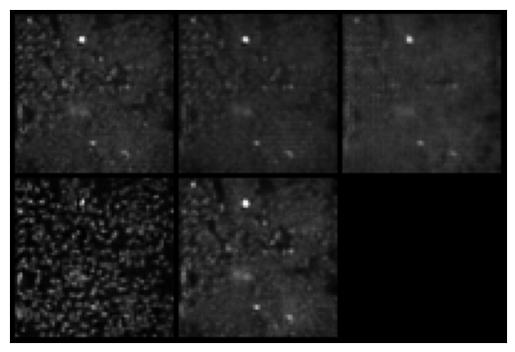

# Cell Painting Data Generation

This notebook aims to explore various algorithms of image generations for Cell Painting Assay images. The goal is to generate realistic image with small scale model, running on a single laptop. Examples of the images generated are at the end of this Readme.

## Data

Cellpainting from the [(Chandrasekaran (2023), ](https://www.biorxiv.org/content/10.1101/2023.03.23.534023v2)[JUMP-Target)](https://broadinstitute.github.io/jump_hub/explanations/data_description.html) were retrieved from the Cell Paiting Gallery [(Weisbart 2024)](https://www.nature.com/articles/s41592-024-02399-z) . The TIFF image were resized from 1080 x 1080 to 64 x 64 and converted to uint8 from uint16. In total a subset of 19806 frames were retrieved. Each image includes 5 channels showing the different components of the cells.

## Models considered

### Variationnal convolutionnal $\beta$-VAE (VAE)

The first and simplest model is a $\beta$-VAE [(Higgins, 2016)](https://arxiv.org/abs/1606.05579). It is composed of 2 models, one to encode the image into a latent space (Encoder) and one to decode the latent space into an image (Decoder). The model is trained with a combination of reconstruction loss (MSE) and KL divergence to a standard normal. An image is actually encoded into a distribution, ensuring some variability. The model trianed here includes 7.8 million parameters, notably due to its large latent dimesion (512). During testing I realised that increasing hhe latent dim space actually still increase the image look on the validation set.

* __Encoder__: The encoder is a convolutionnal neural network using 2D max pooling for downsampling.
* __Decoder__: The decoder is a convolutionnal neural network using transposed convolution for upsampling

### Wasserstein Generative Adversarial network (WGAN-GP)

The Wasserstein GAN [(Arjovsky, 2017)](https://arxiv.org/abs/1701.07875) with gradient penalty [(Gulrajani, 2017)](https://arxiv.org/abs/1704.00028) use 2 models, one to generate an image from a noise patch (Generator) and one evaluating if the image can be discriminated from the other (Discriminator). This version includes 3 millions parametrs.

* __Generator__: The generator is a simple convolutionnal neural network using transposed convolution, it has exactly the same structure as the decoder of the VAE.
* __Discriminator__: The decoder is in structre siilar to the decoder used for VAE, with less channels in the netowrks.

### Denoising diffusion probabilistic model with UNET (DDPM-UNET)

The third implementation is an implementation of the [(Ho, 2020)](https://arxiv.org/pdf/2006.11239). In this case, the generating model is a UNET [(Ronneberger, 2015)](https://arxiv.org/abs/1505.04597) with a more moder architecture, notably including ConvNext block [(Lio, 2022)](https://arxiv.org/abs/2201.03545). In this case the model in total includes 1.9 millions parameters.

## Parameters optimizations

Given that the experiments were ran on a personnal laptop with very limited VRAM, the parameters optimization was limited in scale, as such a simple grid search was used to look for size of the latent space and the inner convolution layers channels for both the VAE and the WGAN-GP. Given the longer training time of the DDPM-UNET model, its parameters were not optimized.

## Training the models

The models are trained when relevant with early stopping (VAE) and for 100 epoch for both the diffusion and WGAN models, which both showed convergence and satisfactory performance. The notebook to train the models is in `src/notebooks/train_models.ipynb`.

## Evaluating the model

The notebook to run the data evaluation is in `src/notebooks/evaluate_models.ipynb`.

### Distribution based method
Model ealuation for image generation is often performed using a previously trained fundational model.ddings. A set of real images disjoints from the trainin set and the same number of generated images from the model. The embeddings are computed for the orginal images as well as the generated images and the distribution are compared using different metrics, for example the Frechet  Distance (FID) [(Heusel, 2017)](https://arxiv.org/pdf/1706.08500) historically used with the Inception mode [(Szegedy, 2015)](https://arxiv.org/abs/1512.00567v3), and Maximum Mean Discrpancy [(Bińkowski, 2018)](https://arxiv.org/abs/1801.01401). In this case we use the FID score for its relative simplicity and widespread usage, we can see that the VAE has the worst score, while the WGAN-GP and the diffusion model have very similar score, with a slight advantage for the WGAN:

### Visual inspection

We can plot some sample images from each of the models.

### Real images

### VAE generated images

The VAE while bale to capture the overall organization of the image is not able to generate the details, a known problem with VAE.

### WGAN generated images

The WGAN produce very similar image to the the real, making them actually quite hard to distinguish.

### Diffusion generated images

The diffusion model also produce pretty  realistic images.

## Folder structure

The data is not provided in this repository because of its size but is available upon request. The main soouces codes of the neural network is in the `src/gencellpainting` module. The notebooks are in `src/notebooks` folder.